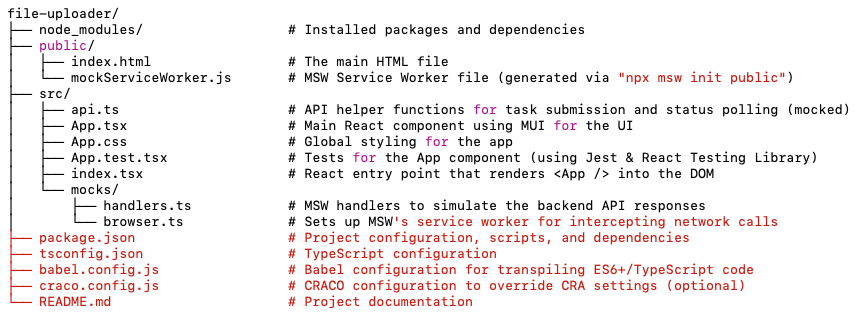

# Getting Started with Create React App

This project was bootstrapped with [Create React App](https://github.com/facebook/create-react-app).

## Available Scripts

In the project directory, you can run:

### `npm start`

Runs the app in the development mode.\
Open [http://localhost:3000](http://localhost:3000) to view it in the browser.

The page will reload if you make edits.\
You will also see any lint errors in the console.

### `npm test`

Launches the test runner in the interactive watch mode.\
See the section about [running tests](https://facebook.github.io/create-react-app/docs/running-tests) for more information.

### `npm run cypress:run`
Make sure to run `npm start` first. And then run this command to run the cypress tests.

## Project Structure

## Project Description

This project is a file uploader web application built with React and TypeScript. It simulates a file upload process with long-running tasks, complete with polling, cancellation, and error-handling functionality. The app is designed with a mobile-first mindset and uses Material-UI (MUI) to create a modern and responsive user interface.

### Key Technologies and Tools

- **React & TypeScript**:  
  The app is developed using React functional components and hooks. TypeScript is used to improve code quality and provide static type checking.

- **Material-UI (MUI)**:  
  MUI components such as `Container`, `Typography`, `Button`, `Box`, and `List` are used to build a clean and responsive UI. This ensures consistency in styling and accelerates UI development.

- **Axios**:  
  Axios handles HTTP requests for submitting files, polling the server for task status, and canceling tasks. The API calls are encapsulated in a dedicated `api.ts` module.

- **MSW (Mock Service Worker)**:  
  MSW is used to intercept HTTP requests and simulate API responses during development and testing. It allows us to create realistic mock endpoints (e.g., `/submit`, `/status/:taskId`, and `/cancel/:taskId`) without needing a real backend server.

- **Jest and React Testing Library**:  
  Tests are written using Jest along with React Testing Library to verify that the UI renders correctly and that user interactions (such as file validation errors and polling timeouts) work as expected.
    - **Jest** is used as the test runner, and `jest.mock` is leveraged to mock Axios calls.
    - **React Testing Library** is used to simulate user interaction with the UI and query DOM elements in a way that reflects actual usage.
- **Cypress**:
    
    Cypress is used for end-to-end testing, allowing us to simulate user interactions and verify that the application behaves as expected in a real browser environment. It provides a powerful way to test the entire flow of the application, from file selection to upload completion.
    
- **CRACO (Create React App Configuration Override)**:  
  Since the project was bootstrapped with Create React App, CRACO is optionally used to override CRA’s default configuration (including Jest settings) so that modules like Axios (which use ESM syntax) can be properly transformed during testing.

### How Testing is Performed

1. **Component Tests**:  
   Tests are written for the main App component (located in `src/App.test.tsx`) using React Testing Library. These tests check for:
    - Correct UI rendering (e.g., ensuring that headings, buttons, and informational messages display correctly).
    - File validation (for example, ensuring an oversized file triggers an alert).
    - Polling behavior (simulating network timeouts, retries, and transitions to error states).

2. **API Mocks**:  
   MSW is used to intercept and simulate HTTP requests, so tests can be run without an actual backend. This ensures consistent and controllable responses during development and test runs.

3. **Automated and Interactive Testing**:  
   The Jest test suite is run via the command line (using `npm test` or `npx craco test` when using CRACO) and through IDE-integrated Jest configurations (e.g., in WebStorm). The configuration ensures that all TypeScript, JSX, and ESM modules are transformed properly using Babel and/or ts‑jest.

This combination of technologies enables a smooth development experience with modern UI components, realistic API simulations, and robust testing practices.

## Questions and Answers
- What did you choose to mock the API and why?
  * Unit test: Jest’s built‑in mocking APIs
  * Integration test: MSW
    * MSW intercepts outgoing HTTP requests, letting you simulate various responses—including delays, errors, and different status codes—much like a real backend would. This can lead to more realistic testing and development scenarios.
  * End-to-end test: Cypress
    * Cypress runs in a real browser, allowing you to test the entire application flow, including file uploads and API interactions. It provides a more comprehensive testing environment that closely resembles how users will interact with the app.
- If you used an AI tool, what parts did it help with?
  ChatGPT:  
    1. Generate test cases and scenarios for the application. (Honestly, I could have done this myself, but it was faster to ask ChatGPT and what I did is just give descriptions of the test cases I wanted.)
    2. Generate the README file. (ChatGPT did a great job here, but I had to make some adjustments to fit my style and add some details.)
    3. Help me create all configure file for MSW, Jest, and Cypress.
- What tradeoffs or shortcuts did you take?
  - Simplified API Behavior
  - File Validation Using Alerts: 
    Using alerts is a quick way to provide feedback, but it’s not the best user experience; a production-quality UI might use inline validation messages or a modal instead.
  - No Jest test for Timeout/Retry scenario: Tried to implement one but not work.s Give up decisively for time limit.
- What would you improve or add with more time?
    - Add more tests, especially for edge cases and error handling.
    - Improve the UI/UX, such as using modals for alerts and adding loading indicators.
    - Try to use React Query for data fetching and caching.
- What was the trickiest part and how did you debug it?
    Timeout and retry and test case for it.
